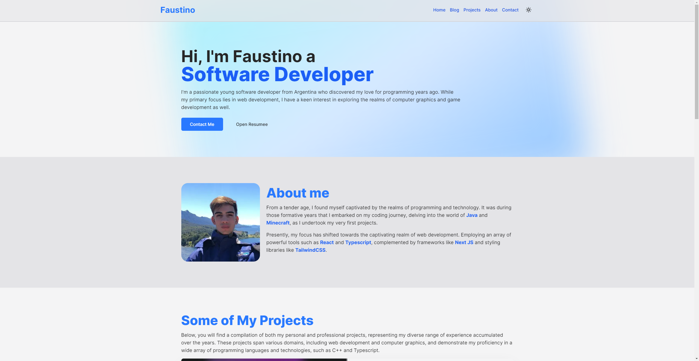

<h1 align="center">Welcome to my Portfolio 👋</h1>

<div align="center">
  
  <p>
    <a href="https://www.npmjs.com/package/portfolio" target="_blank">
      
    </a>
    <a href="https://github.com/faustinozanetto/portfolio#readme" target="_blank">
      
    </a>
    <a href="https://github.com/faustinozanetto/portfolio/graphs/commit-activity" target="_blank">
      
    </a>
    <a href="https://github.com/faustinozanetto/portfolio/blob/master/LICENSE" target="_blank">
      
    </a>
    <a href="https://twitter.com/faustinozanetto" target="_blank">
      
    </a>
  </p>
</div>

> My personal portfolio.

## ✨ About

This projects involves developing a personal portfolio with features such as blog with mdx posts, projects page and much more.

## 🚀 Installation and Usage

To get the project started up and working you need follow the next steps:

```sh
git clone https://github.com/faustinozanetto/portfolio # First clone the repo in your folder of choice.
cd portfolio # Move into the recently cloned repo.
yarn install # Install using yarn or npm.
yarn start:dev # Boot up the project using the following command.
```

## 🛠️ Technologies

The project is being developed with the latest technlogoies used in the industry like:

- NextJS
- TailwindCSS
- Typescript
- Husky
- ESLint
- Prettier
- And more

## 👤 Author

**Faustino Zanetto**

- Website: https://faustinozanetto.vercel.app/
- Twitter: [@faustinozanetto](https://twitter.com/faustinozanetto)
- Github: [@faustinozanetto](https://github.com/faustinozanetto)
- LinkedIn: [@faustinozanetto](https://linkedin.com/in/faustino-zanetto-4294a3213)

## 📝 License

Copyright © 2022 [Faustino Zanetto](https://github.com/faustinozanetto).<br />
This project is [MIT](https://github.com/faustinozanetto/portfolio/blob/master/LICENSE) licensed.
